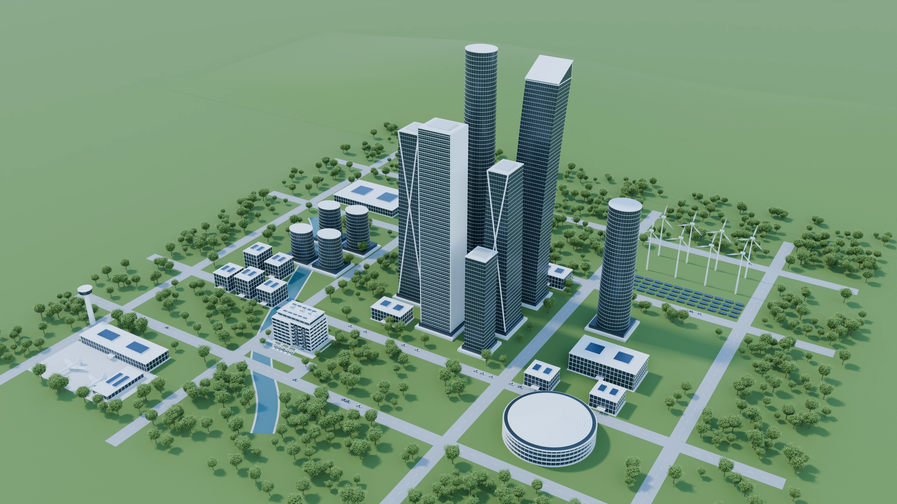

# ECC Buildings

[中文](#中文) · [English](#english)



## 中文

ECC Buildings 是一款交互式空间探索演示，串联互联城市、住宅公寓楼、电气室和概念性的低压开关柜。界面支持中文和英文切换。

在线预览：[ECC Buildings · GitHub Pages](https://lukidesign.github.io/ECC-Buildings/)。

### 本地运行

需要 Node.js 22.13 或更高版本，以及 npm。

```sh
cd web
npm ci
npm run dev -- --host 127.0.0.1 --port 3000
```

打开 [http://localhost:3000/buildings](http://localhost:3000/buildings)。运行测试、类型检查和构建：

```sh
cd web
node --experimental-strip-types --test tests/*.test.mjs
npx tsc --noEmit
npm run build
```

在 `web/` 下运行 `npm run build:pages` 可在本地构建 GitHub Pages 静态版本，输出位于 `web/pages-dist/`。推送到 `main` 后，GitHub Actions 会自动重新构建并发布。

### 探索内容

- 通过场景热点或导航卡片，依次探索城市 → 公寓楼 → 电气室 → 低压开关柜。
- 拖动电气室全景或使用方向键环视，按 Home 键重置视角。
- 打开开关柜详情，查看概念说明和应用指南。
- 切换中英文时保留当前场景和视角；语言偏好保存在浏览器中。
- 在窄屏设备上，使用完整的电气室静态图和纵向导航。

ECC 主题的主要交互色为 `#2563EB`，激活文字色为 `#1D4ED8`，选中背景色为 `#EFF6FF`。色彩变量定义在 `web/app/globals.css`。

### 项目结构

| 路径 | 用途 |
| --- | --- |
| `web/components/landscape/` | 路由、语言切换、场景热点、电气室全景和产品详情 |
| `web/app/` | 页面布局、响应式场景样式和主题 |
| `web/public/assets/` | 优化后的图片、8K 全景图、转场视频和热点元数据 |
| `source/build_scenes.py` | 可编辑的 Blender 程序化场景源码 |
| `source/*.blend` | 可编辑的场景母版 |
| `source/render_delivery.py` | 室外场景静态图和城市至公寓楼的镜头动画 |
| `source/export_assets.mjs` | Web 媒体优化与导出 |

网站使用本地资源，不连接真实设备，也没有后端实时数据。开关柜画面和应用文案仅用于概念展示，不代表具体产品或工程图纸。

### 重建媒体资源

运行网站所需的优化媒体已包含在 `web/public/assets/`。可使用 Blender 5.2 和 `source/build_scenes.py` 重建可编辑资源；完整电气室全景图的渲染时间明显长于静态图。仓库包含场景母版，无需获取参考网站的模型或媒体即可编辑。

场景素材由本项目独立建模，参考网站仅为体验设计提供启发；应用中不包含参考网站的视频、模型或全景图。本文不暗示任何品牌授权或设备认证。

## English

An interactive ECC spatial explorer for a connected city, apartment building, electrical room, and a conceptual low-voltage switchgear assembly. The interface supports Chinese and English.

Live preview: [ECC Buildings on GitHub Pages](https://lukidesign.github.io/ECC-Buildings/).

### Run locally

Requirements: Node.js 22.13 or newer and npm.

```sh
cd web
npm ci
npm run dev -- --host 127.0.0.1 --port 3000
```

Open [http://localhost:3000/buildings](http://localhost:3000/buildings). To run the checks:

```sh
cd web
node --experimental-strip-types --test tests/*.test.mjs
npx tsc --noEmit
npm run build
```

To build the static GitHub Pages preview locally, run `npm run build:pages` from `web/`. The generated site is in `web/pages-dist/`. Pushing to `main` rebuilds and publishes it through GitHub Actions.

### Explore

- Follow the city → apartment → electrical room → switchgear route through scene hotspots or the navigation card.
- Drag the room panorama, use arrow keys to look around, and press Home to reset the view.
- Open the cabinet details for a conceptual overview and an application guide.
- Switch between Chinese and English without losing the current scene or room view. The preference is saved in the browser.
- On narrow screens, use the complete room still image and the vertical navigation.

The ECC theme uses `#2563EB` for its main interactive color, `#1D4ED8` for active text, and `#EFF6FF` for selected backgrounds. The palette is defined in `web/app/globals.css`.

### Project structure

| Path | Purpose |
| --- | --- |
| `web/components/landscape/` | Routes, language, hotspots, room panorama, and product sheet |
| `web/app/` | Layout, responsive scene styling, and theme |
| `web/public/assets/` | Optimized images, 8K panorama, transition video, and marker metadata |
| `source/build_scenes.py` | Editable procedural Blender scene source |
| `source/*.blend` | Editable scene masters |
| `source/render_delivery.py` | Exterior stills and city-to-apartment camera move |
| `source/export_assets.mjs` | Optimized web media export |

The runtime uses local assets and has no live equipment connection or backend data feed. The cabinet visuals and application text are conceptual, not a specified product or engineering drawing.

### Rebuilding media

The optimized media required to run the site is already under `web/public/assets/`. Blender 5.2 can rebuild the editable assets from `source/build_scenes.py`; the complete room panorama takes substantially longer than the still images. Source masters are included so the scenes can be edited without acquiring the reference site's models or media.

The scene assets were independently modeled as a visual study. Earlier site references informed the experience, but no reference-site video, model, or panorama is included in the app. No brand or equipment certification is implied.
