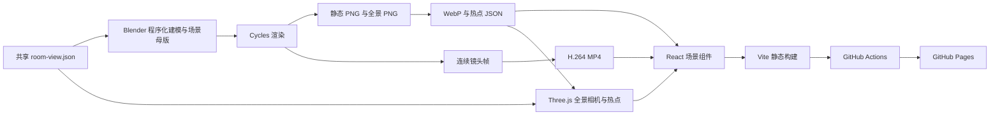
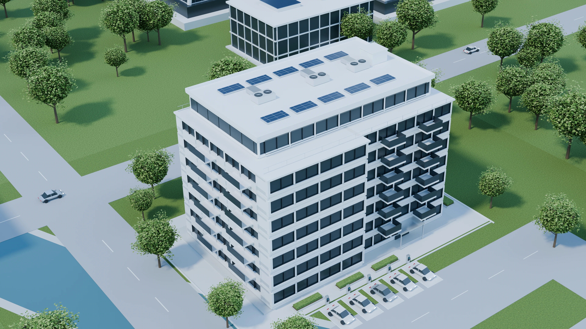
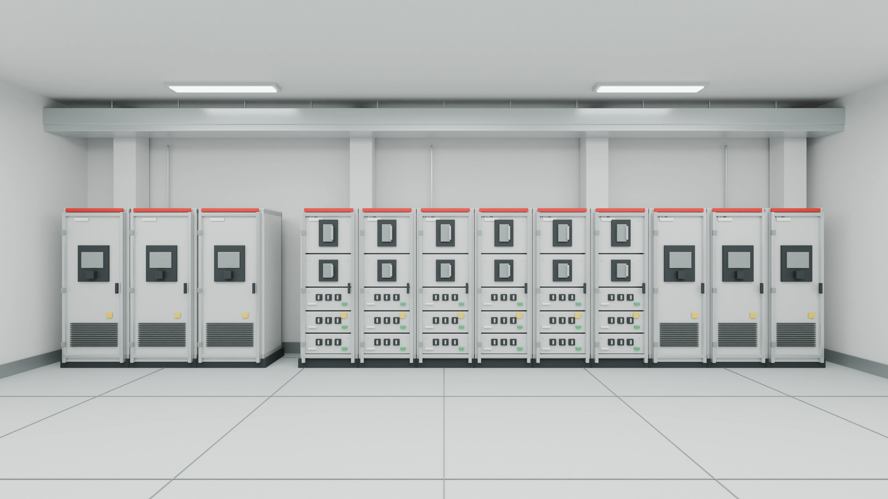
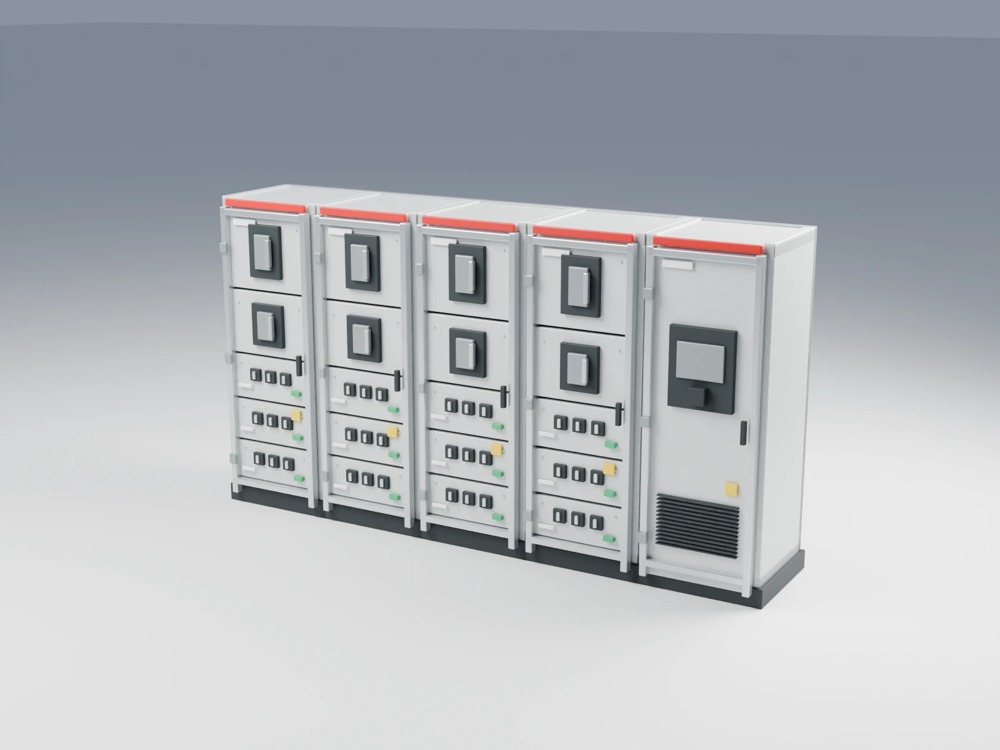
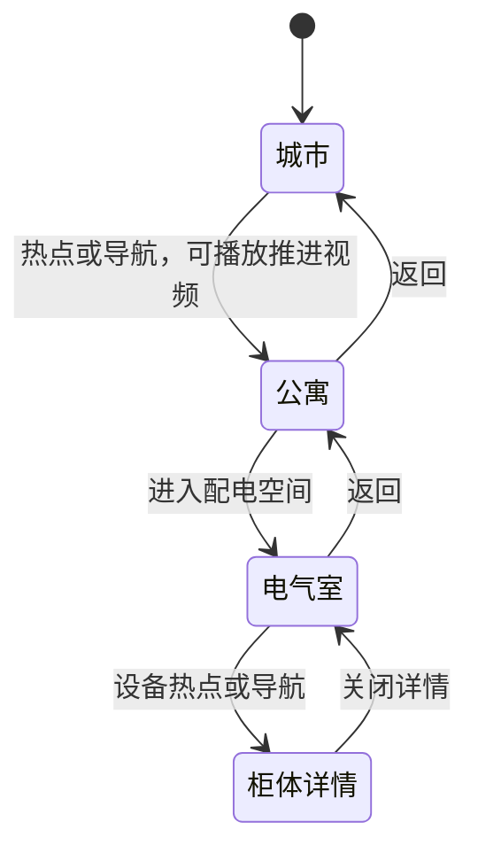

# ECC Buildings 技术与实现方案

> 编写日期：2026-09-18。实现基线：`ed9508c`，即已完成 GitHub Pages 发布及双语 README 的版本；文件路径已按本次仓库目录整理同步更新。本文根据项目代码、模型生成脚本和实际媒体资源整理；图片为当前项目的渲染素材，不包含网页控制面板。

- [在线演示](https://lukidesign.github.io/ECC-Buildings/)
- [代码仓库](https://github.com/lukidesign/ECC-Buildings)
- [启动说明与中英文 README](../README.md)

## 1. 项目目标与交付范围

| 项目 | 说明 |
| --- | --- |
| 问题陈述（Problem Statement） | 将建筑空间与配电应用串联为可以访问、浏览和分享的交互演示，并解决建筑造型不合理、电气室取景过近、缺少语言切换和公开访问入口的问题。 |
| 方案描述（Proposed Solution） | 使用 Blender 创建场景和渲染媒体；React 组织导航、热点与产品详情；Three.js 显示电气室全景；提供 ECC 科技蓝主题、中英文切换和 GitHub Pages 静态发布。 |
| 技术约束（Technical Constraints） | 已发布站点必须能以静态文件运行；支持 `/ECC-Buildings/` 路径前缀；本地原有入口继续工作；图片、视频、相机配置和热点坐标需要保持一致。 |
| 明确不做（Non-goals） | 本轮不实现真实设备接入、账号系统、后台管理、实时能耗数据、建筑内部自由行走或整座城市的实时三维渲染。 |
| 成功标准（Success Criteria） | 城市、公寓、电气室、开关柜详情形成完整浏览路径；语言切换保留当前上下文；电气室默认视角能展示整排柜体；公开链接和已知场景深层链接可直接打开；源码及媒体可在独立检出环境构建。 |

本项目借鉴建筑探索类网站的体验形式，以独立建模素材完成实现。最终用户界面使用 ECC 标识，柜体使用通用低压开关柜描述。

## 2. 总体技术路线

当前方案组合了三种展示方式：城市与公寓使用预渲染图片，城市进入公寓使用预渲染视频，电气室使用全景贴图提供固定观察点的环视交互。浏览器中的 Three.js 场景只负责全景球体和相机，并未加载整座城市或柜体的可交互实体模型。



这一选择把复杂材质、植被和光照计算放到离线渲染阶段，网页主要下载压缩媒体并处理交互。代价是城市视角和推进轨迹已经固定，电气室也只支持旋转观察，无法产生位置移动带来的视差。

### 2.1 技术栈

以下前端版本来自当前 `web/package-lock.json`；Blender 版本来自电气室媒体元数据。

| 技术 | 当前版本 | 实际职责 |
| --- | --- | --- |
| Blender / Python | 5.2.0 LTS / `bpy` | 建筑、园区、设备建模，相机设置，场景保存和离线渲染 |
| React | 19.2.6 | 场景切换、弹层、语言和媒体状态 |
| TypeScript | 5.9.3 | 组件与导航数据的类型检查 |
| Vite | 8.0.13 | 前端打包及独立的 Pages 静态构建 |
| Vinext | 1.0.0-beta.5 | 现有应用目录结构的本地开发及服务端构建入口 |
| Three.js | 0.186.0 | 全景球体、透视相机、纹理显示及热点投影 |
| Tailwind CSS | 4.2.1 | 基础样式与通用组件样式；场景布局另由 `explorer.css` 控制 |
| Radix UI | 1.6.7 | 产品详情抽屉、标签页及对应的基础交互 |
| GitHub Actions / Pages | 仓库工作流 | 在 `main` 推送后构建并托管静态站点 |

项目依赖中还保留了框架模板的数据库和通用组件工具。这些依赖的存在不代表站点已经接入数据库或业务后台。

## 3. 场景制作与视觉修正

### 3.1 城市与建筑


*图 1：城市总览渲染。该图作为浏览入口，网页在其上叠加导航卡片及公寓热点。*

主要建模代码位于 [scripts/blender/build_scenes.py](../scripts/blender/build_scenes.py)。脚本以米为推定单位、Z 轴向上，通过 `Batch` 将同一语义对象按材质组织网格，并在父对象上记录 `semantic_id`。建筑、窗框、屋顶、道路、车辆、树木和设备由基础几何及重复布局构成；随机种子固定为 `784`，便于重复生成。

材质使用 Principled BSDF，通过基础颜色、粗糙度、金属度以及噪声、凹凸节点表现玻璃、金属、草地和混凝土。主渲染流程使用 Cycles 和 AgX 色彩管理。

本次对屋顶逻辑的修正落实在 `tower()` 中：

- 圆形和椭圆形塔楼按实际生成的楼层数计算顶部高度，屋顶轮廓跟随最后一层立面尺寸。
- 倾斜屋顶补充封闭的楔形围护体，与顶层楼板连接。
- 屋面板具有约 0.45 米厚度和受控的 0.6 米挑檐，并补充边框、竖向分格等构件，形成可解释的体积关系。

这些尺寸用于当前可视化造型，并非经过工程校核的施工尺寸。

### 3.2 公寓与连续镜头



*图 2：从城市总览进入的公寓楼。两端画面来自同一城市场景中的同一栋建筑。*

[scripts/blender/render_delivery.py](../scripts/blender/render_delivery.py) 打开 `city-apartment.blend`，在城市远景与公寓近景之间插值相机位置、观察目标和焦距。插值使用 `t²(3−2t)`，使起止变化更平缓。该脚本同时输出两端静态图及对应热点元数据，减少切换时建筑形态和位置不一致的问题。

当前推进视频由 73 帧组成，成品是 1920 × 1080、30 fps 的 H.264 MP4，时长约 2.43 秒。网页只在桌面端主动从城市进入公寓、且用户没有开启“减少动态效果”偏好时播放。

### 3.3 电气室完整展示



*图 3：修正后的电气室静态视图。完整柜体及周围空间共同建立尺度和设备排列关系。*

电气室包含房间外壳、前排柜体、后侧 UPS、桥架、电缆、灯具、检修门和辅助设施。为解决原先近距离观察导致的柜体裁切，观察点移到后侧通道，并以共享相机配置约束 Blender 与网页。

配置文件：[web/components/landscape/room-view.json](../web/components/landscape/room-view.json)。

| 参数 | 当前值 | 用途 |
| --- | --- | --- |
| `eye` | `[0, -3.55, 1.7]` | 相机位于后侧通道，观察高度约 1.7 米 |
| `target` | `[0, 3.5, 1.7]` | 水平朝向前排柜体 |
| `hotspot` | `[1.69, 3.34, 1.3]` | 设备热点的空间坐标 |
| `lensMm` | `19.5` | 初始取景焦距 |
| `sensorWidthMm` | `36` | 视场角换算基准 |
| `baseAspect` | `16 / 9` | 基准画幅比例 |

前端随窗口比例调整垂直视场角，以维持水平覆盖范围。宽度不超过 700px 时使用完整的 16:9 静态图，电气室图像采用 `object-fit: contain`。

### 3.4 开关柜详情



*图 4：产品详情使用的柜体组合示意。网页提供概述和应用说明两个标签页。*

产品图在独立灯光与地面环境中渲染。当前详情用于解释进线、配电、监测等功能分区，没有设备实时数据、选型计算或配置下单功能。

## 4. 媒体资产与导出

### 4.1 当前资源规格

大小采用实际文件字节数换算为十进制 MB，四舍五入。

| 文件 | 规格 | 大小 | 使用位置 |
| --- | --- | --- | --- |
| `city.webp` | 3840 × 2160 | 1.14 MB | 城市背景与缩略图 |
| `apartment.webp` | 3840 × 2160 | 1.33 MB | 公寓背景与缩略图 |
| `room.webp` | 3840 × 2160 | 0.20 MB | 电气室底图、移动端和失败回退 |
| `room-panorama.webp` | 8192 × 4096 | 0.91 MB | 电气室等距柱状全景纹理 |
| `product.webp` | 1600 × 1200 | 0.07 MB | 开关柜详情 |
| `city-to-apartment.mp4` | 1920 × 1080，30 fps | 9.58 MB | 城市至公寓推进视频 |

资源目录为 [web/public/assets/](../web/public/assets/)。三份 `*-metadata.json` 保存相机与热点位置，[manifest.json](../web/public/assets/manifest.json) 记录图片来源、分辨率和导出大小。上述主要媒体总计约 13.23 MB，不代表首屏一定同时下载全部资源。

### 4.2 导出流程

1. Blender 输出 PNG、可编辑 `.blend` 和热点 JSON。
2. [scripts/assets/export_assets.mjs](../scripts/assets/export_assets.mjs) 使用 Sharp 转换 WebP：普通图片质量参数为 92，全景为 94，`effort` 为 5。
3. 将热点 JSON 复制到网页资源目录，生成图片 manifest。
4. 镜头帧另行编码为 MP4，放入同一资源目录。

图片导出脚本不负责视频编码；缺少某张源 PNG 时会跳过该项，不能只根据脚本退出成功判断媒体齐全。Sharp 当前由依赖树提供，没有作为该脚本的独立直接依赖声明，维护时需要确认其可解析性。

## 5. 前端结构与状态流转

核心组件是 [landscape.tsx](../web/components/landscape/landscape.tsx)。两套构建入口复用它以及同一套样式、语言字典和媒体。

| 文件 | 职责 |
| --- | --- |
| [landscape.tsx](../web/components/landscape/landscape.tsx) | 当前场景、导航、视频转场、详情抽屉、错误提示和响应式分支 |
| [navigation.ts](../web/components/landscape/navigation.ts) | 场景路径、URL 解析、部署前缀和资源路径 |
| [panorama.tsx](../web/components/landscape/panorama.tsx) | Three.js 全景、鼠标与键盘控制、热点投影及资源释放 |
| [language.tsx](../web/components/landscape/language.tsx) | 语言状态、持久化和切换按钮 |
| [translations.ts](../web/components/landscape/translations.ts) | 中英文本映射、浏览器语言判断、旧偏好迁移 |
| [globals.css](../web/app/globals.css) | 全局颜色变量及基础样式 |
| [explorer.css](../web/app/explorer.css) | 场景画面、浮层、产品详情和移动端布局 |

### 5.1 导航和 URL

| 状态 | 本地路径 | Pages 路径 |
| --- | --- | --- |
| 城市 | `/buildings` | `/ECC-Buildings/buildings` |
| 公寓 | `/buildings/bt_appart` | `/ECC-Buildings/buildings/bt_appart` |
| 电气室 | `/buildings/bt_appart/bt_appart_el_room` | `/ECC-Buildings/buildings/bt_appart/bt_appart_el_room` |
| 柜体详情 | 电气室路径追加 `?mc=low_voltage_switchgear` | 同样追加该查询参数 |

站点根目录也显示城市。导航调用 `history.pushState()`；浏览器前进、后退通过 `popstate` 重新解析场景。尾部斜杠在解析时移除，旧产品查询值 `low_voltage_mns_switchgear` 保留兼容。



进入目标场景时先更新场景状态，转场视频覆盖在目标图上。视频结束、播放被拒绝、媒体失败或超过 4.5 秒时结束覆盖层。这样即使转场无法播放，导航仍然可以完成。

### 5.2 图片热点定位

Blender 将三维热点投影为归一化坐标 `x/y`；网页根据图片 `object-fit: cover` 的缩放与裁切计算热点屏幕坐标。

```text
s = max(容器宽 / 1920, 容器高 / 1080)
left = (容器宽 − 1920 × s) / 2 + marker.x × 1920 × s
top  = (容器高 − 1080 × s) / 2 + marker.y × 1080 × s
```

当前使用 1920 × 1080 作为 16:9 计算基准，与现有 4K 外景图的比例一致。虽然元数据包含分辨率，当前公式没有自动读取该字段；新增非 16:9 图片时需要调整计算方式。热点 JSON 加载失败时，侧边导航仍可用于进入下一场景。

## 6. 电气室全景的实现

进入桌面端电气室后才动态导入 Three.js。组件创建半径为 10 的球体，反转 X 轴使其表面朝内，再旋转几何体以匹配全景方向。相机位于球体内部，球面贴上 8192 × 4096 的等距柱状图。

核心参数与行为：

- `PerspectiveCamera` 根据共享的焦距、传感器宽度和画幅比例计算视场角。
- Blender 的相对坐标 `(dx, dy, dz)` 转为 Three.js 的 `(dx, dz, -dy)`，再通过相机投影定位 HTML 热点。
- 拖动调整水平角和俯仰角，俯仰范围限制在约 ±0.72 弧度；方向键微调，Home 重置。
- 产品详情打开时阻止全景拖动；热点移出有效视野后隐藏并退出键盘焦点顺序。
- 使用 `ResizeObserver` 响应尺寸变化；像素比上限为 2。
- 主要在加载、交互和窗口变化时绘制，没有持续的每帧动画循环。
- WebGL 失效或纹理加载失败时显示提示，并保留静态底图和设备入口。
- 组件卸载时释放纹理、几何体、材质、渲染器、事件监听和观察器。

压缩后的全景文件不到 1 MB，但 8192 × 4096 的 RGBA 像素数据约为 128 MiB，尚未计入 mipmap 和其他 GPU 开销。因此压缩文件小并不意味着所有设备上的显存消耗都小；当前移动端静态分支降低了这一压力，低端桌面 GPU 仍需单独验证。

## 7. 中英文与 ECC 主题

### 7.1 语言切换

语言状态为 `zh` 或 `en`，英文原文作为字典键，中文集中在 `translations.ts`。当前没有引入独立的国际化框架。

读取优先级为：有效的 `ecc-language` → 有效的旧键 `abb01-language` → 浏览器语言。读取到旧偏好时尝试写入新键；存储不可用时，当前会话仍可以切换。

切换时同步更新界面文本、网页标题、`html.lang`、图片替代文本和交互标签。页面状态不依赖语言重建，电气室朝向保存在引用中，因此语言切换可保留当前场景及视角。产品详情内部也放置语言按钮，使其位于弹层的焦点范围内。

仓库 README 另采用“中文在前、英文在后”的单文件结构，并通过顶部锚点跳转；它与运行时的语言状态独立。

### 7.2 色彩与品牌

| 变量 | 色值 | 用途 |
| --- | --- | --- |
| `--brand` | `#2563EB` | 主交互色、热点、文字标识和重点线条 |
| `--brand-hover` | `#1D4ED8` | 激活及悬停文字 |
| `--brand-strong` | `#1E40AF` | 更强的强调文字 |
| `--brand-soft` | `#EFF6FF` | 选中背景 |
| `--brand-soft-hover` | `#DBEAFE` | 悬停背景 |

ECC 标识使用文字形式；页面标题、产品详情、页脚和 favicon 使用对应身份。场景图片中的柜顶红条、状态按钮等属于模型材质，当前仍保留在渲染图中，CSS 科技蓝主题不会改变这些已经渲染的像素。

## 8. GitHub Pages 发布方案

### 8.1 两套入口复用同一应用

原有入口通过 `web/app/`、Vinext 和 Cloudflare 构建配置运行。Pages 使用 [static-preview/main.tsx](../web/static-preview/main.tsx) 直接挂载 `Landscape`，并导入同一套 CSS。

独立配置 [vite.pages.config.ts](../web/vite.pages.config.ts) 指定：

```text
源码入口：web/static-preview/
路径前缀：/ECC-Buildings/
静态资源：web/public/
产物目录：web/pages-dist/
```

静态入口采用 `static-preview` 目录，是为了避免被原框架识别成 `pages` 路由；产物独立于 `dist`，避免普通应用构建清理同一输出目录。

### 8.2 资源前缀与直接访问

`appPath()` 和 `assetPath()` 判断当前路径是否位于 `/ECC-Buildings` 下，分别补齐导航路径和图片、视频、JSON 的地址。`parseLocation()` 去掉仓库前缀后识别场景。本地 `/buildings` 仍使用根路径资源。

[finalize-pages.mjs](../web/scripts/finalize-pages.mjs) 在构建后把入口 HTML 复制到三个已知场景的目录中，使直接访问或刷新这些路径时能够找到实际文件；同时生成 `404.html` 和 `.nojekyll`。

`404.html` 可以让未知路径显示可恢复的界面，但未知路径的 HTTP 响应仍可能是 404。仓库前缀目前写死为 `/ECC-Buildings/`，迁移仓库名、部署目录或域名布局时，需要同步检查导航工具、Vite 配置和 favicon 路径。

### 8.3 自动部署

工作流：[.github/workflows/pages.yml](../.github/workflows/pages.yml)。

```text
推送 main 或手动触发
  → 检出仓库
  → 设置 Node.js 22
  → 在 web/ 执行 npm ci
  → npm run build:pages
  → 配置 Pages
  → 上传 web/pages-dist
  → 部署到 github-pages 环境
```

该流程使用 `contents: read`、`pages: write` 和 `id-token: write` 权限。当前工作流只执行依赖安装和静态构建，没有自动执行单元测试与 TypeScript 检查；此前这些检查在本地独立检出环境完成。若后续需要每次发布前强制检查，应把相应命令加入工作流。

截至本轮交付，静态站点已经发布，首页、电气室直达路径与全景资源曾实测返回 HTTP 200；双语 README 提交对应的发布工作流也已成功。这些是本次验收记录，不是持续在线监测。

## 9. 本地开发与媒体重建

### 9.1 启动与构建

以下命令从项目根目录执行第一步，之后保持在 `web/`：

```sh
cd web
npm ci
npm run dev -- --host 127.0.0.1 --port 3000
```

访问 [本地建筑场景](http://localhost:3000/buildings)。需要构建 Pages 版本时，在另一个终端进入 `web/`：

```sh
npm run build:pages
npx vite preview --config vite.pages.config.ts --host 127.0.0.1 --port 4173
```

访问 [本地静态预览](http://127.0.0.1:4173/ECC-Buildings/)。`npm run build` 仍用于原有应用构建，Pages 发布使用 `npm run build:pages`。

### 9.2 场景重建入口

已交付网页包含完整的运行媒体，浏览站点无需安装 Blender。需要改模型时，可先打开 `models/` 下的 `.blend` 母版，或通过脚本重新生成。

下面是重建命令示例，假设 `blender` 已加入 PATH，并且当前目录为项目根目录。生成器会写入同名 `.blend` 和渲染产物，编辑过母版后应先保存副本。

```sh
# 灰模预览：先检查体量、结构和视角
blender --background --python scripts/blender/build_scenes.py -- --scene city --quality gray

# 电气室静态图
blender --background --python scripts/blender/build_scenes.py -- --scene room --quality final

# 电气室全景：可在 GPU 全景渲染不适用时使用 CPU
blender --background --python scripts/blender/build_scenes.py -- --scene room --view panorama --quality final --cpu

# 将已存在的 PNG 导出到网页资源目录
node scripts/assets/export_assets.mjs
```

`--scene city --view apartment` 可生成共享城市场景的公寓视角；`render_delivery.py` 再读取 `city-apartment.blend` 输出外景端点，添加 `--motion` 可输出连续镜头帧。

当前 `build_scenes.py` 对 Metal 初始化有 CPU 回退，而 `render_delivery.py` 直接配置 Metal，跨平台运行前需要适配设备选择。媒体导出与视频编码也不是单条命令覆盖的全自动生产线；修改模型后，应重新核对母版、PNG、WebP、视频及元数据的一致性。

## 10. 质量验证与对抗式审查

### 10.1 已有自动化检查

测试目录为 [web/tests/](../web/tests/)。本次交付基线共有 60 项测试，覆盖：

- 场景路径、尾部斜杠、产品查询参数和 Pages 前缀。
- 语言偏好优先级、旧数据迁移、不可用存储和翻译字典。
- ECC 配色、若干前景与背景组合的文字对比度，以及历史品牌文案检查。
- 相机位于通道的数值约束，指定视口下柜体边界的投影范围和热点位置。

在 `web/` 中运行：

```sh
node --experimental-strip-types --test tests/*.test.mjs
npx tsc --noEmit
npm run build
npm run build:pages
```

已有视口数值检查包括 1920 × 1080、1366 × 768、1280 × 720、2180 × 1000 和 960 × 768。它们验证的是配置和数学投影，不等价于所有浏览器上的视觉验收、设备性能测试或完整无障碍认证。

### 10.2 人工复核重点

| 反向检查问题 | 需要观察的结果 |
| --- | --- |
| 从电气室或产品 URL 直接打开，而不是从首页进入？ | 场景和抽屉状态正确；刷新后能继续访问 |
| 推进视频播放失败或用户快速返回？ | 不留下覆盖层，不阻止导航 |
| 图片、热点 JSON 或 WebGL 不可用？ | 用户仍有导航或产品入口；相应错误有可理解的提示 |
| 转动全景后切换语言、打开和关闭详情？ | 场景、朝向、焦点与产品状态符合预期 |
| 窗口变窄或切换到移动端？ | 主要内容可见，电气室静态图完整，控制项不遮挡关键区域 |
| 调整建筑形状、相机或全景热点？ | 渲染素材、元数据与前端共享参数同步更新 |

本轮已完成独立检出的依赖安装、测试、类型检查及静态构建，并检查公开页面、资源加载与产品直达链接。新增场景或修改相机后，应重新执行与变更相关的验证。

## 11. 后续维护与扩展

| 需求 | 主要修改位置 | 同时需要处理的内容 |
| --- | --- | --- |
| 增加建筑或房间 | 场景生成脚本、`navigation.ts`、`landscape.tsx` | 图片、热点、翻译、静态路由入口和导航测试 |
| 修改电气室视角 | `room-view.json`、Blender 重新渲染 | 静态图、全景图、热点元数据及视口检查 |
| 更换品牌或主题 | `globals.css`、翻译字典、页面元数据、favicon | 位图中的文字与颜色需要在模型或渲染阶段处理 |
| 调整公开部署位置 | Pages 构建配置、路径工具、静态入口 | 深层链接、资源地址和 README 预览地址 |
| 接入真实设备信息 | 新增数据层与设备标识映射 | 接口、刷新策略、状态及权限设计，现有代码尚未实现 |
| 支持自由漫游或单个柜体操作 | 新增实体模型的实时三维加载方案 | 可交互模型、相机移动、拾取、遮挡和性能预算 |

当前组件与媒体足以承载有限场景的展示。场景数量增加后，可把标题、路径、资源、热点和入口关系集中为场景配置表；此项属于扩展建议，尚未在当前版本实现。

## 12. 交付文件与阅读顺序

建议先阅读 [README.md](../README.md) 启动应用，再查看 `landscape.tsx` 和 `navigation.ts` 理解浏览流程；涉及全景时阅读 `panorama.tsx` 与 `room-view.json`；涉及资产生产时阅读 `build_scenes.py`、`render_delivery.py` 和 `export_assets.mjs`；涉及上线时阅读 Pages 构建配置和仓库工作流。

仓库保留网页源码、运行媒体、必要生成脚本及可编辑场景母版。`.local/renders/` 原始渲染、`.local/work/` 中间帧、`.local/evidence/` 验收记录和 `.local/archive/` 历史资料留在本地，由 `.gitignore` 排除。`tools/` 保留原路径下的本地工具环境。

本文四张配图直接引用 `web/public/assets/` 中的现有文件，没有重复复制素材。将文档随仓库查看可正常显示；若单独转交 Markdown，需要一并保留对应图片和相对目录结构（文档位于 `docs/`，图片位于 `web/public/assets/`）。
